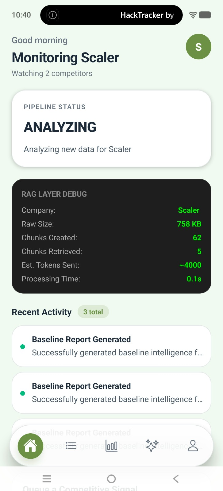
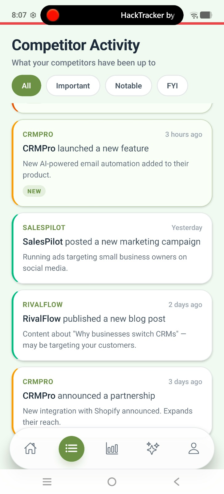
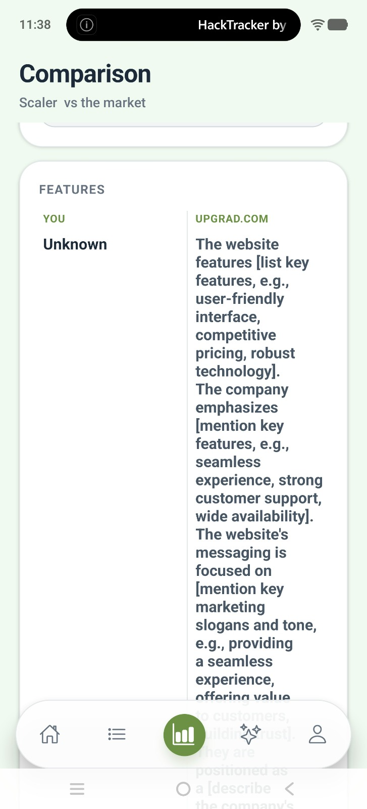
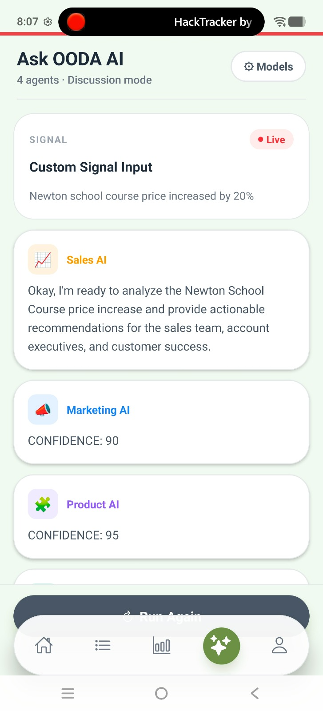
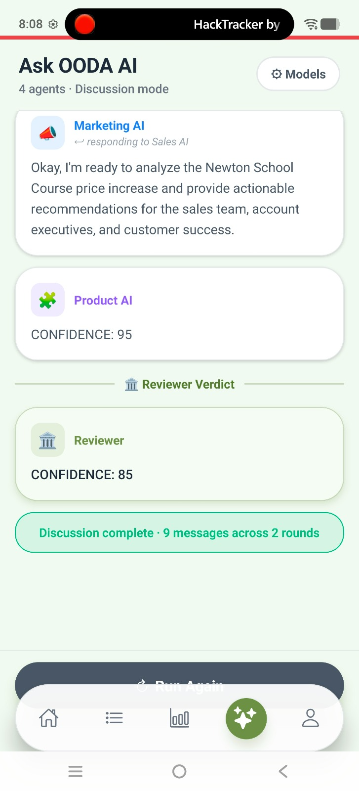
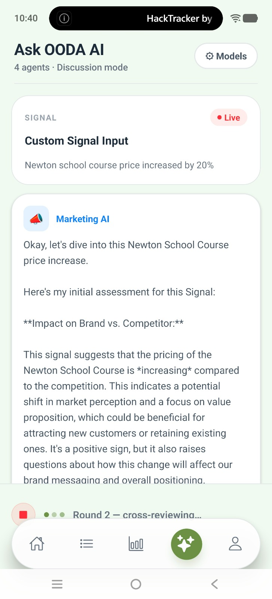
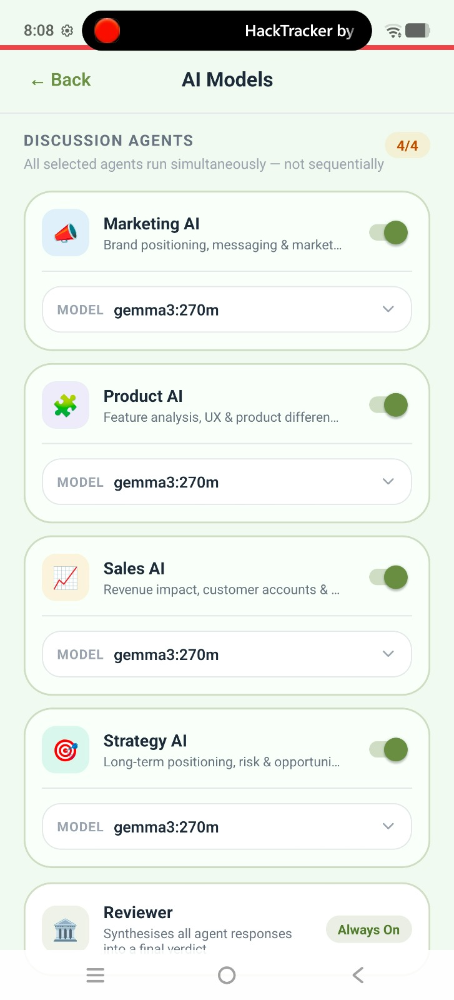

# OODA AI Mobile App

OODA (Observe, Orient, Decide, Act) is a mobile-first executive companion and competitive intelligence application. It leverages a localized, privacy-first multi-agent execution engine to automatically scrape, analyze, and synthesize competitive signals into actionable business insights.

## Core Features
- **Multi-Agent Execution Engine**: Runs a simulated executive boardroom (Marketing, Product, Sales, Strategy) in parallel to analyze signals from multiple angles.
- **Reviewer Synthesis**: A specialized agent consolidates the multi-agent discussion into a final, actionable verdict.
- **Background Web Scraper**: Automatically runs in the background on an interval to pull the latest competitive data, completely offline-aware.
- **Provider Agnostic**: Switch seamlessly between local models (Ollama) for absolute privacy, or cloud models (OpenAI, Anthropic) for heavy lifting.
- **Environment Driven**: Zero hardcoded API paths. All behavior is securely configurable via `.env`.

## Documentation
Please refer to the following documents to understand and work with the OODA application:

1. [**HOW_TO_USE.md**](./HOW_TO_USE.md) - Getting started, running the local AI node, and using the app.
2. [**ARCHITECTURE.md**](./ARCHITECTURE.md) - Deep dive into the codebase structure, configuration layers, and provider abstractions.
3. [**WORKFLOW.md**](./WORKFLOW.md) - Understanding the data lifecycle from web scraping to multi-agent analysis.

## Prerequisites

Before setting up the project, ensure you have the following installed:
1. **Ollama**: You must have Ollama installed and running on your local machine (or accessible from your mobile device/network). 
2. **Local AI Models**: Pull the specific models you intend to use via the Ollama CLI before running the app (e.g., `ollama run llama3.2:1b`).

## Setup & Installation

Follow these steps to set up the OODA mobile application locally:

1. **Clone the repository and install dependencies:**
   ```bash
   npm install
   ```

2. **Set up your environment variables:**
   - Copy the example environment file to create your local config.
   - **Rename `.env.example` to `.env`**.
   - Open `.env` and fill in your local IP address for the Scraper API or Ollama URL if you are testing on a physical device.

3. **Start the Metro Bundler:**
   ```bash
   npx expo start
   ```

4. **Run the Application:**
   - **For Android:** Press `a` in the terminal to open the app on a connected Android device or emulator.
   - **For iOS:** Press `i` in the terminal to open the app on an iOS simulator (Requires a Mac with Xcode).
   - Alternatively, scan the QR code using the **Expo Go** app on your physical mobile device.

*For more advanced configuration, including running the local Python AI scraper node, refer to the `HOW_TO_USE.md` document.*







